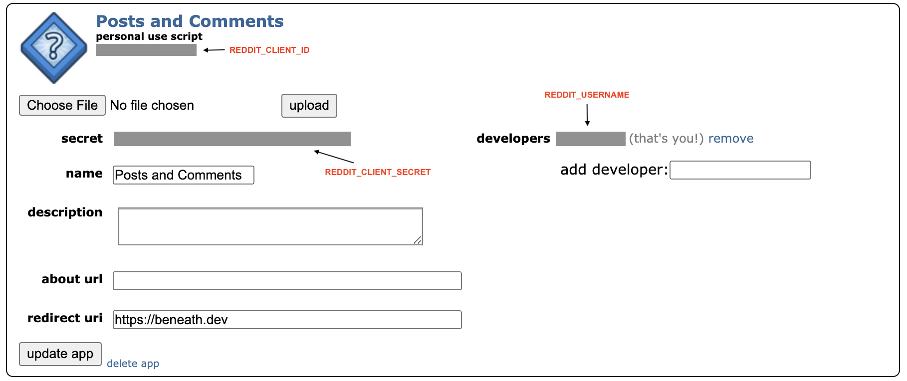

# Run a Reddit scraper in 10 minutes

**This tutorial is [posted on Replit](https://replit.com/@ericpgreen/Run-a-Reddit-scraper-in-10-minutes?v=1), a remote code execution environment.**

Want to build a trading bot based on stock mentions in r/wallstreetbets? Or a dashboard to explore the political sentiment in r/politics?

The first step is to build your Reddit dataset, and that's where this Replit App comes into play. This app scrapes Reddit in real-time and writes the data to Beneath, a data platform. Taken together, Replit hosts your code while Beneath hosts your data, like Batman and Robin.

See the scraper in action! Check out these real-time [r/wallstreetbets posts](https://beneath.dev/examples/reddit/table:r-wallstreetbets-posts).

With your data on Beneath, APIs are automatically generated so you can query the data with SQL, build a React dashboard, or issue alerts. Here are [code snippets for the r/wallstreetbets posts API](https://beneath.dev/examples/reddit/table:r-wallstreetbets-posts/-/api).

This tutorial guides you through setting up Beneath, registering an application with Reddit, and running the Reddit scraper for the subreddit of your choice. It's just installations, filling out a form, then 2 one-liner commands... we got this.

## Setup Beneath (3 min)

**To start, fork this repl.** The forked repl is a version just for you where you can input your own parameters.

Now, let's start by setting up Beneath. Run the following 4 commands in the Replit Shell.

Upgrade pip (if you get an error from `dephell`, you can ignore it):
```bash
pip install --upgrade pip
```

Install dependencies:
```bash
poetry install
```

Create a Beneath account and authenticate your Replit environment. Replit will try and fail at opening up the link automatically, so you should click on the generated link in the Shell. Then follow the instructions. If the Replit Shell hangs, try again but be a bit quicker.
```bash
beneath auth
```

Create a Beneath project: 
```bash
beneath project create BENEATH_USERNAME/reddit
```

## Register a Reddit app (3 min)
Now let's register our scraper with Reddit. Anybody who uses the Reddit API needs to let Reddit know how they're using it. After filling out a quick form, you get authentication credentials specific to you.

Head over to https://www.reddit.com/prefs/apps (you need a Reddit account), click "are you a developer? create an app...", and fill out the form. Here's how I did it: 

While I chose a script for personal use, if you're building a web or mobile app based on Reddit data, you should select the corresponding bullet. Here's a [detailed guide about this form](https://github.com/reddit-archive/reddit/wiki/OAuth2) if you need it. If you intend to make money from your app, make sure you read the full [Reddit API terms](https://www.reddit.com/wiki/api).

## Load your Reddit credentials (1 min)
Next, you'll need to load your Reddit credentials into Replit Shell environment variables.

Here's the overview of my app and its credentials: 

Run the following commands to set the environment variables. (It won't work if you set the secrets through Replit's Secrets UI, because the Shell can't access those secrets.)

The diagram above shows where to find the `REDDIT_CLIENT_ID`, `REDDIT_CLIENT_SECRET`, and `REDDIT_USERNAME`
```bash
export REDDIT_CLIENT_ID=...
```
```bash
export REDDIT_CLIENT_SECRET=...
```
```bash
export REDDIT_USERNAME=...
```

Now set the name of the subreddit you want to scrape! Enter it without any prefix, like in this example:
```bash
export REDDIT_SUBREDDIT=wallstreetbets
```

## Run it! (3 min)

Almost done! 

The data pipeline defined in `main.py` writes Reddit posts and comments to two Beneath tables. The table structures are defined by the files in the `schemas` folder. Before going live, the pipeline needs those tables to exist and needs a service with write permissions. 

With this command, we stage the resources and name the service "r-SUBREDDIT-scraper" (we're using the Reddit convention to prefix a subreddit with an 'r'):

```bash
python main.py stage BENEATH_USERNAME/reddit/r-SUBREDDIT-scraper --write-quota-mb 10000
```

Then run the pipeline:

```bash
python main.py run BENEATH_USERNAME/reddit/r-SUBREDDIT-scraper
```

Head over to https://beneath.dev/BENEATH_USERNAME/reddit and select a table to see your data arrive in real-time. The comments table will likely be the most active. See some records stream in?

Once you have some data, try out the Beneath APIs. Query with SQL, use the Python pipeline API, read the data into a Pandas Dataframe, or use the React snippet to read the data into a frontend. Think of something creative to build!

If you're on the Free plan, Replit will shut off your scraper after about 30 minutes. If you want to keep it running, you'll have to purchase Replit's Hacker Plan and turn your repl "Always On". If you don't want to do that, or if you want to jump straight to a big dataset (since it takes time to build up extensive history), you can play with the Beneath [example Reddit project](https://beneath.dev/examples/reddit), which has been live since March.

Enjoy!